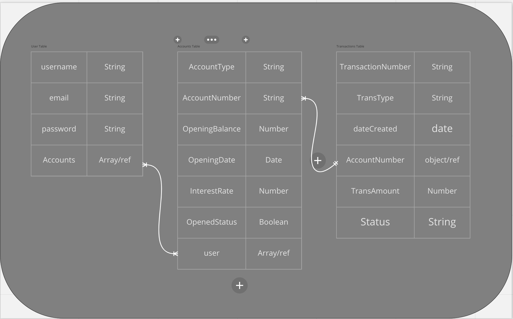
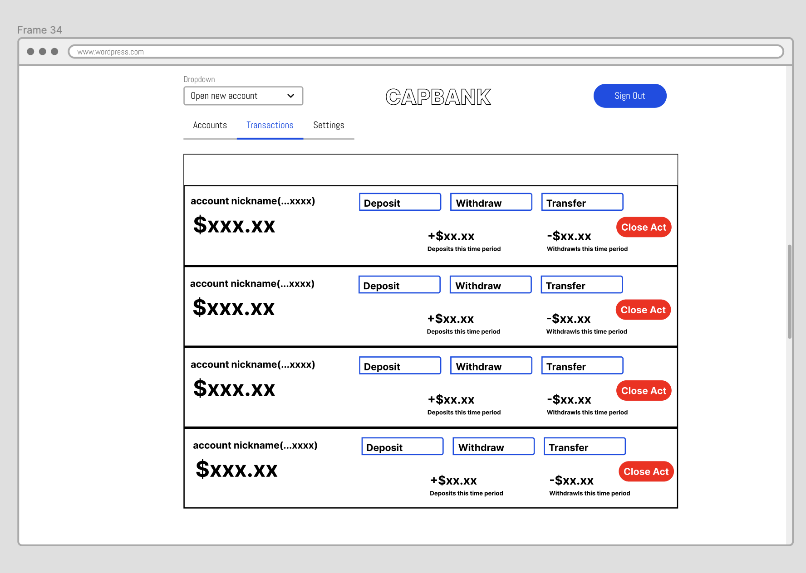

# CapBank

### App Description
#### CapBank is a full stack banking (psuedo ATM) application created with Angular as the front-end framework, SpringBoot as the Java back-end framework and MongoDB as the database. Users will be able to sign in to their accounts, complete transactions such as depositing, withdrawing, creating new accounts, and checking balances. 
---
### Tech Descriptions

Angular is a component based framework that allows an application to be written once and become cross-platform easily.Angular is written in Typescript to create a modular single page application. Typescript is built on javascript and uses a compiler to translate typescript into html readable javascript. The main advantages are the ability to see errors while in the editor (aka in realtime, as opposed to during runtime) and the ability to define and set the scope of objects and functions using interfaces

Java is a object-oriented programming language that is used for multi-platform developement. It can be used for web and desktop applications, mobile applications (especially Andriod apps), servers, and games. Java is written in classes with attributes and methods to create functionality. This project will use SpringBoot as the java backend framework to use built in features to create the API between the frontend and the database.

MongoDB is a nonrelational database that uses documents to store data in field-value pairs in objects. It provides query methods to conduct CRUD operations on the JSON like documents.

---
## ERDs

---
## Restful Routing Chart

---
## Wireframes

---
## User Stories
As a user:
- I want to sign up at the bank
- I want log in and see all my accounts with quick details
- I want to be able to create a checkings or a savings account, or multiple of both
- I want to be able to make deposits, withdrawls, or transfers 
- I want to see an accounts history of transactions
- I want to be able to stay signed in for a certain duration
- I want to be able to log out
---
## MVP Goals
- a login page with authentication methods 
- ability to show all accounts owned by user
- ability to only see transactions for each account
- ability to add accounts
- ability to give account a nickname
- ability to create a transaction
- ability to close account
- ability to sort accounts
---
## Stretch Goals
- mobile friendly/responsive front end
- ability to create autosave transactions from checkings to saving
- ability to transfer to other users 
- ability to create pending or posted transactions
- ability to have a mobile 'pay' feature to act as debit card