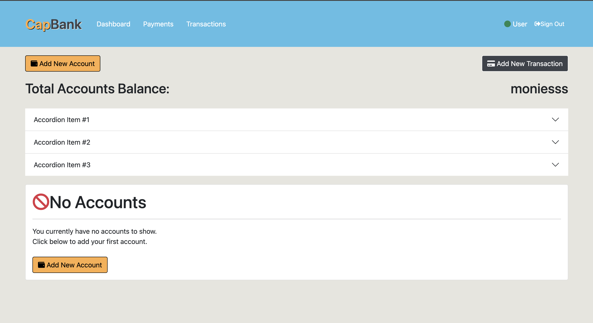

# CapBank

### App Description
#### CapBank is a full stack banking (psuedo ATM) application created with Java Server Pages to serve a single page front-ent, SpringBoot as the Java back-end framework and MySQL as the database. Users will be able to sign in to their accounts, complete transactions such as depositing, withdrawing, creating new accounts, and checking balances. 

#### The main goal of this project is so create an introduction into other marketable languages and create a project that will be continously developed along with other full stack applications. A secondary goal is to take the learned languages and transfer those concepts to other languages. 

---

## CapBank

---
### Tech Descriptions

JavaServer Pages (JSP) is a Java standard technology that enables you to write dynamic, data-driven pages for your Java web applications. From a coding perspective, JSPs let you start with the client-side script or markup, then embed JSP tags to connect your page to the Java backend.

Java is a object-oriented programming language that is used for multi-platform developement. It can be used for web and desktop applications, mobile applications (especially Andriod apps), servers, and games. Java is written in classes with attributes and methods to create functionality. This project will use SpringBoot as the java backend framework to use built in features to create the API between the frontend and the database.

MySQL is the most popular Open Source Relational SQL database management system. The data in a MySQL database are stored in tables. A table is a collection of related data, and it consists of columns and rows.

---
## ERDs

---
## Restful Routing Chart

---
## Wireframes

---
## User Stories
As a user:
- I want to sign up at the bank
- I want log in and see all my accounts with quick details
- I want to be able to create a checkings or a savings account, or multiple of both
- I want to be able to make deposits, withdrawls, or transfers 
- I want to see an accounts history of transactions
- I want to be able to stay signed in for a certain duration
- I want to be able to log out
---
## MVP Goals
- a login page with authentication methods 
- ability to show all accounts owned by user
- ability to only see transactions for each account
- ability to add accounts
- ability to give account a nickname
- ability to create a transaction
- ability to close account
- ability to sort accounts
---
## Possible Roadblocks
- problem solving/debugging in new languages
- time/sprint management
---
## Stretch Goals
- mobile friendly/responsive front end
- ability to create autosave transactions from checkings to saving
- ability to transfer to other users 
- ability to create pending or posted transactions
- ability to have a mobile 'pay' feature to act as debit card
